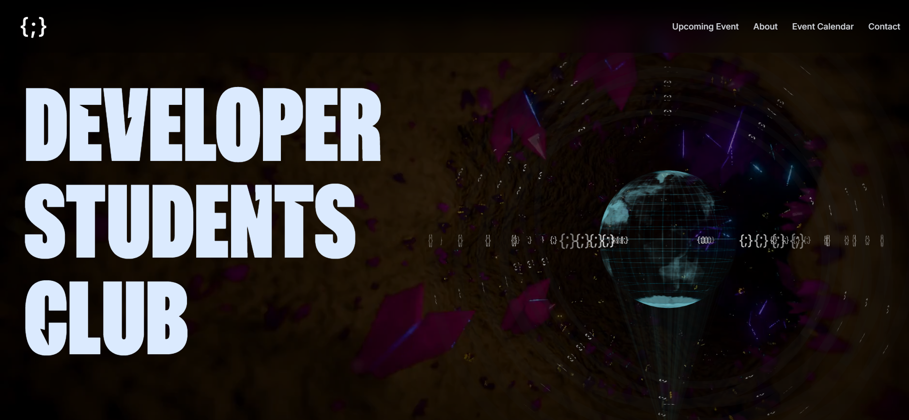
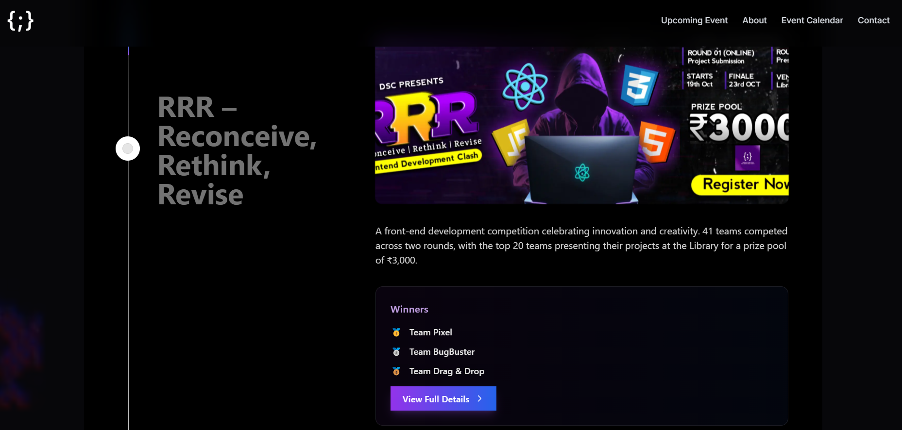
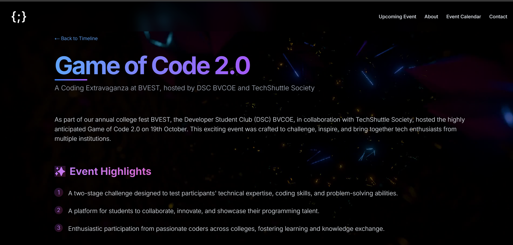
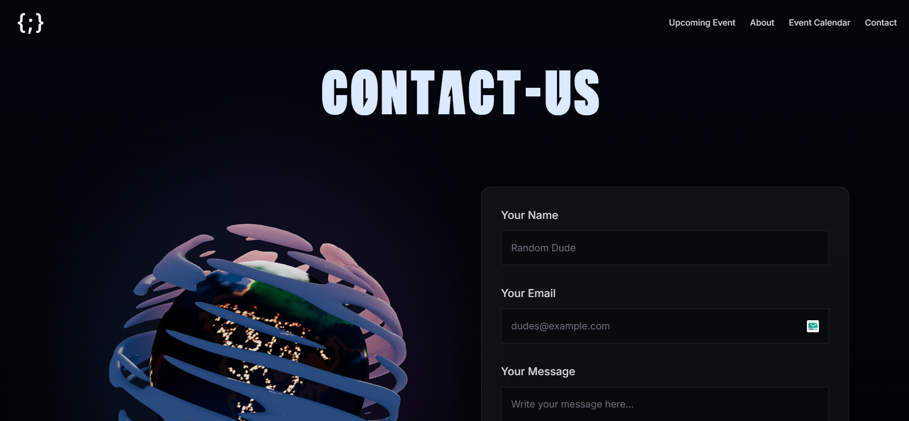
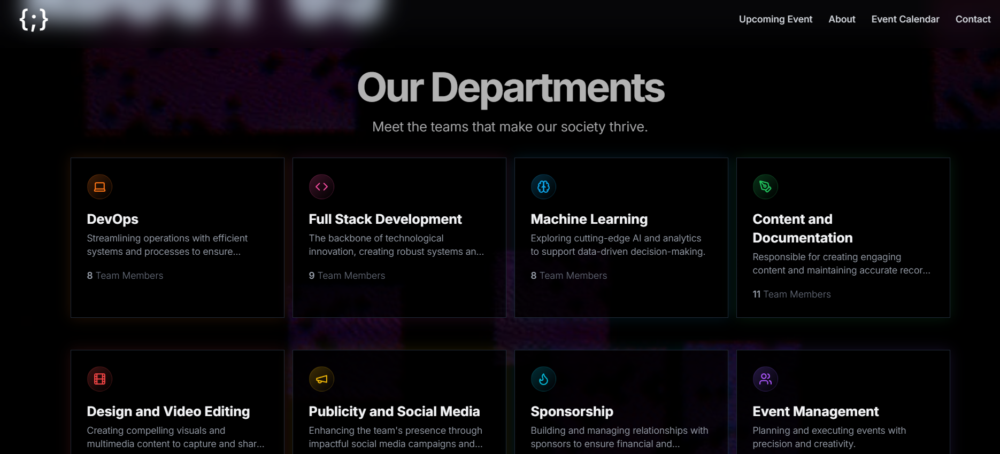

# Developer Students Club - BVCOE


## 🚀 About DSC BVCOE

Developer Students Club at Bharati Vidyapeeth's College of Engineering is a community of passionate student developers, designers, and innovators. We foster learning and collaboration in technology through workshops, events, and projects.

## ✨ Website Features

### 🏠 Home Page



- Modern, responsive design with dynamic animations
- Featured events and activities showcase
- Interactive 3D Earth visualization
- Latest news and announcements

### 📅 Event Timeline



- Comprehensive event calendar
- Detailed event pages with registration links
- Past event highlights and winners
- Event photo galleries

### 👥 About Us

- Team member profiles
- Department information
- Club mission and vision
- History and achievements

### 📞 Contact

- Contact form for inquiries
- Social media links
- Location information

## 🛠️ Tech Stack

- **Frontend Framework:** Next.js 14
- **Styling:** Tailwind CSS
- **UI Components:** Custom components with modern design
- **Animations:** Framer Motion
- **3D Graphics:** Three.js
- **Deployment:** Vercel

## 🌟 Featured Events

### RRR – Reconceive, Rethink, Revise

- Front-end development competition
- 41 participating teams
- Prize pool of ₹3,000
- Winners showcase

### Game of Code 2.0

- Part of BVEST
- Multi-stage coding challenge
- Inter-college participation
- Technical problem-solving focus

## 🚀 Getting Started

1. Clone the repository:

```bash
git clone https://github.com/your-username/dsc-site.git
```

2. Install dependencies:

```bash
npm install
```

3. Run the development server:

```bash
npm run dev
```

4. Open [http://localhost:3000](http://localhost:3000) in your browser

## 📸 Screenshots


_Homepage Hero Section_


_Events Timeline_


_Team Section_

## 🤝 Contributing

We welcome contributions from the community! Please read our contributing guidelines before submitting pull requests.

## 📄 License

This project is licensed under the MIT License - see the [LICENSE](LICENSE) file for details.

## 🔗 Links

- [Website](https://dsc-bvcoe.vercel.app)
- [Instagram](https://instagram.com/dsc_bvcoe)
- [LinkedIn](https://linkedin.com/company/dsc-bvcoe)
- [GitHub](https://github.com/dsc-bvcoe)

---

Made with ❤️ by Developer Students Club BVCOE
